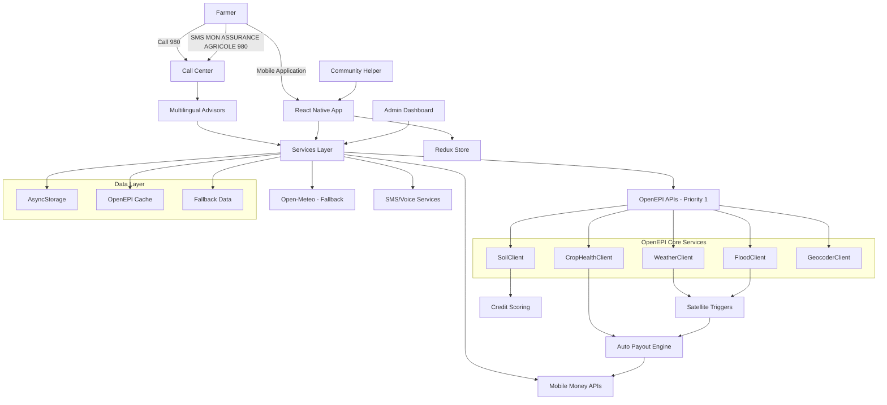

# Technical Architecture - ClimInvest

## System Overview

ClimInvest uses a mobile-first architecture with React Native, primarily integrating OpenEPI APIs for climate data and multi-channel accessibility features to serve farmers in West Africa.

## Architecture Diagram



## Detailed Technical Stack

### Mobile Frontend

```typescript
const techStack = {
  framework: "React Native 0.72",
  language: "TypeScript 5.0",
  navigation: "React Navigation 6",
  stateManagement: "Redux Toolkit",
  storage: "AsyncStorage",
  ui: "React Native Elements + Custom Components",
  accessibility: "Native React Native A11y + Voice Support",
  testing: "Jest + React Native Testing Library",
  primaryAPI: "OpenEPI (WeatherClient, SoilClient, FloodClient)",
  fallbackAPI: "Open-Meteo, NASA POWER"
}
```

### Integrated External Services - OpenEPI Priority

| Service | Function | Status | Rate Limit | Priority |
|---------|----------|--------|------------|----------|
| **OpenEPI WeatherClient** | Real-time weather data | Integrated | 1000/day | 1 |
| **OpenEPI SoilClient** | Soil quality | Integrated | 1000/day | 1 |
| **OpenEPI FloodClient** | Flood detection | Integrated | 1000/day | 1 |
| **OpenEPI CropHealthClient** | Crop health | Integrated | 1000/day | 1 |
| **Open-Meteo** | Weather fallback | Active | Unlimited | 2 |
| **NASA POWER** | Historical data | Active | Unlimited | 3 |
| **MTN MoMo** | Payments | Simulated | 100/min | - |
| **Orange Money** | Payments | Simulated | 60/min | - |

## Multi-Modal Access Channels

### 1. Phone Call to 980

```typescript
// Phone call flow
interface CallFlowService {
  handleIncomingCall(phoneNumber: string, language: string): Promise<CallSession>;

  // Guided process steps
  steps: {
    welcome: "Welcome to ClimInvest. Choose your language",
    identification: "Provide your name and location",
    cropSelection: "What type of crop do you grow?",
    riskAssessment: "Analyzing your area via OpenEPI...",
    premiumCalculation: "Your monthly premium is X FCFA",
    paymentSetup: "Mobile Money payment configuration",
    confirmation: "Your insurance is active. Confirmation SMS sent"
  }
}
```

### 2. Simple SMS to 980

```typescript
// Automated SMS service
class SMSService {
  async handleSMSSubscription(phoneNumber: string, message: string) {
    if (message.toUpperCase().includes("MON ASSURANCE AGRICOLE")) {
      return await this.initiateSMSFlow(phoneNumber);
    }
  }

  private async initiateSMSFlow(phoneNumber: string) {
    const responses = [
      "Welcome! Reply 1 for French, 2 for Fon, 3 for Yoruba",
      "Indicate your region: 1-Cotonou, 2-Porto-Novo, 3-Parakou...",
      "Crop type: 1-Corn, 2-Cotton, 3-Peanut, 4-Yam",
      "Analyzing your area via OpenEPI...",
      "Calculated premium: 800 FCFA/month. Reply YES to confirm",
      "Mobile Money payment configured. Insurance active!"
    ];

    // Sequential SMS sending with response waiting
    for (const response of responses) {
      await this.sendSMS(phoneNumber, response);
      await this.waitForResponse(phoneNumber);
    }
  }
}
```

### 3. Complete Mobile Application

```typescript
// Adaptive navigation based on access channel
export default function AppNavigator() {
  const { isAuthenticated, accessChannel } = useSelector((state: RootState) => state.auth);

  return (
    <NavigationContainer>
      <Stack.Navigator>
        {!isAuthenticated ? (
          <>
            <Stack.Screen name="Onboarding" component={OnboardingScreen} />
            <Stack.Screen name="Registration" component={RegistrationScreen} />
            <Stack.Screen name="Login" component={LoginScreen} />
          </>
        ) : (
          <Stack.Screen name="MainTabs" component={TabNavigator} />
        )}
      </Stack.Navigator>
    </NavigationContainer>
  );
}
```

## OpenEPI Integration - Detailed Architecture

### Main OpenEPI Service

```typescript
// services/openEpiService.ts - Service principal
import {
  WeatherClient,
  SoilClient,
  FloodClient,
  CropHealthClient,
  GeocoderClient
} from 'openepi-client';

export class OpenEpiService {
  private weatherClient: WeatherClient;
  private soilClient: SoilClient;
  private floodClient: FloodClient;
  private cropHealthClient: CropHealthClient;
  private geocoderClient: GeocoderClient;

  constructor() {
    const config = {
      apiKey: process.env.OPENEPI_API_KEY,
      baseURL: process.env.OPENEPI_BASE_URL
    };

    this.weatherClient = new WeatherClient(config);
    this.soilClient = new SoilClient(config);
    this.floodClient = new FloodClient(config);
    this.cropHealthClient = new CropHealthClient(config);
    this.geocoderClient = new GeocoderClient(config);
  }

  // Real-time meteorological data
  async getCurrentWeather(lat: number, lon: number) {
    try {
      const forecast = await this.weatherClient.getLocationForecast(lat, lon);
      return this.processWeatherData(forecast);
    } catch (error) {
      console.error('❌ OpenEPI Weather Error:', error);
      throw new Error('Unable to retrieve OpenEPI weather data');
    }
  }

  // Soil quality analysis
  async getSoilQuality(lat: number, lon: number) {
    try {
      const soilType = await this.soilClient.getSoilType(lat, lon);
      const soilProperties = await this.soilClient.getSoilProperties(lat, lon);

      return {
        type: soilType,
        properties: soilProperties,
        quality_score: this.calculateSoilScore(soilProperties),
        recommendations: this.generateSoilRecommendations(soilType, soilProperties)
      };
    } catch (error) {
      console.error('❌ OpenEPI Soil Error:', error);
      throw new Error('Unable to analyze soil quality');
    }
  }

  // Flood detection
  async getFloodRisk(lat: number, lon: number) {
    try {
      const floodData = await this.floodClient.getFloodRisk(lat, lon);
      return {
        risk_level: floodData.riskLevel,
        probability: floodData.probability,
        historical_events: floodData.historicalEvents,
        trigger_threshold: this.calculateFloodTrigger(floodData)
      };
    } catch (error) {
      console.error('❌ OpenEPI Flood Error:', error);
      throw new Error('Unable to assess flood risk');
    }
  }

  // Crop health monitoring
  async getCropHealth(lat: number, lon: number, cropType: string) {
    try {
      const healthData = await this.cropHealthClient.getCropHealth(lat, lon, cropType);
      return {
        ndvi_current: healthData.ndvi,
        health_status: this.interpretNDVI(healthData.ndvi),
        stress_indicators: healthData.stressIndicators,
        recommendations: this.generateCropRecommendations(healthData, cropType)
      };
    } catch (error) {
      console.error('❌ OpenEPI Crop Health Error:', error);
      throw new Error('Unable to monitor crop health');
    }
  }
}
```

### Hybrid Service with Fallback

```typescript
// services/hybridOpenEpiService.ts - Service with intelligent fallback
export class HybridOpenEpiService {
  private openEpiService: OpenEpiService;
  private fallbackServices: {
    weather: OpenMeteoService;
    soil: SimulatedSoilService;
    flood: SimulatedFloodService;
  };

  constructor() {
    this.openEpiService = new OpenEpiService();
    this.initializeFallbackServices();
  }

  async getWeatherData(lat: number, lon: number) {
    try {
      // Priority 1: OpenEPI
      console.log('🌍 Attempting OpenEPI WeatherClient...');
      const openEpiData = await this.openEpiService.getCurrentWeather(lat, lon);
      console.log('✅ OpenEPI WeatherClient: Success');
      return { source: 'OpenEPI', data: openEpiData };

    } catch (openEpiError) {
      console.warn('⚠️ OpenEPI unavailable, fallback to Open-Meteo');

      try {
        // Fallback: Open-Meteo
        const fallbackData = await this.fallbackServices.weather.getCurrentWeather(lat, lon);
        console.log('✅ Open-Meteo Fallback: Success');
        return { source: 'Open-Meteo', data: fallbackData };

      } catch (fallbackError) {
        console.error('❌ All weather services failed');
        // Simulated data as last resort
        return {
          source: 'Simulated',
          data: this.generateDefaultWeatherData(lat, lon)
        };
      }
    }
  }

  async getSoilAnalysis(lat: number, lon: number) {
    try {
      // Absolute priority: OpenEPI SoilClient
      console.log('🌍 Soil analysis via OpenEPI SoilClient...');
      const soilData = await this.openEpiService.getSoilQuality(lat, lon);
      console.log('✅ OpenEPI SoilClient: Complete analysis');
      return { source: 'OpenEPI', data: soilData };

    } catch (error) {
      console.warn('⚠️ OpenEPI SoilClient unavailable, simulated data');
      return {
        source: 'Simulated',
        data: this.generateSimulatedSoilData(lat, lon)
      };
    }
  }
}
```

### Automatic Trigger System

```typescript
// services/triggerService.ts - OpenEPI-based triggering
export class AutoTriggerService {
  private openEpiService: OpenEpiService;
  private payoutService: PayoutService;

  async evaluateAllTriggers() {
    const activePolicies = await this.getActivePolicies();

    for (const policy of activePolicies) {
      await this.evaluatePolicyTriggers(policy);
    }
  }

  private async evaluatePolicyTriggers(policy: InsurancePolicy) {
    const { latitude, longitude, cropType } = policy.location;

    try {
      // OpenEPI data collection
      const [weatherData, floodRisk, cropHealth] = await Promise.all([
        this.openEpiService.getCurrentWeather(latitude, longitude),
        this.openEpiService.getFloodRisk(latitude, longitude),
        this.openEpiService.getCropHealth(latitude, longitude, cropType)
      ]);

      // Trigger threshold evaluation
      const triggers = {
        drought: this.evaluateDroughtTrigger(weatherData, cropHealth),
        flood: this.evaluateFloodTrigger(floodRisk),
        cropStress: this.evaluateCropStressTrigger(cropHealth)
      };

      // Automatic triggering if thresholds reached
      for (const [triggerType, isTriggered] of Object.entries(triggers)) {
        if (isTriggered) {
          await this.triggerAutomaticPayout(policy, triggerType, {
            weatherData,
            floodRisk,
            cropHealth
          });
        }
      }

    } catch (error) {
      console.error(`❌ Trigger evaluation error for policy ${policy.id}:`, error);
    }
  }

  private evaluateDroughtTrigger(weatherData: any, cropHealth: any): boolean {
    // Thresholds based on OpenEPI data
    const droughtIndicators = {
      consecutiveDryDays: weatherData.consecutive_dry_days > 21,
      lowNDVI: cropHealth.ndvi_current < 0.3,
      highTemperature: weatherData.temperature_max > 38,
      lowSoilMoisture: weatherData.soil_moisture < 0.2
    };

    // Trigger if at least 3 indicators are true
    const triggeredCount = Object.values(droughtIndicators).filter(Boolean).length;
    return triggeredCount >= 3;
  }

  private async triggerAutomaticPayout(
    policy: InsurancePolicy,
    triggerType: string,
    evidenceData: any
  ) {
    console.log(`🚨 Automatic trigger: ${triggerType} for policy ${policy.id}`);

    const payoutAmount = this.calculatePayoutAmount(policy, triggerType, evidenceData);

    await this.payoutService.processAutomaticPayout({
      policyId: policy.id,
      triggerType,
      amount: payoutAmount,
      evidence: evidenceData,
      timestamp: new Date().toISOString()
    });

    // Automatic SMS notification
    await this.notificationService.sendPayoutNotification(
      policy.farmerPhone,
      `Automatic compensation of ${payoutAmount} FCFA triggered by ${triggerType}. Payment in progress via Mobile Money.`
    );
  }
}
```

## OpenEPI-Based Credit Scoring

```typescript
// services/creditScoringService.ts
export class CreditScoringService {
  private openEpiService: OpenEpiService;

  async calculateCreditScore(
    farmerId: string,
    location: { lat: number; lon: number },
    cropType: string,
    farmSize: number
  ): Promise<FarmerCreditScore> {
    
    try {
      // OpenEPI data collection for scoring
      const [soilQuality, cropHealth, weatherHistory, floodRisk] = await Promise.all([
        this.openEpiService.getSoilQuality(location.lat, location.lon),
        this.openEpiService.getCropHealth(location.lat, location.lon, cropType),
        this.openEpiService.getWeatherHistory(location.lat, location.lon, 5), // 5 years
        this.openEpiService.getFloodRisk(location.lat, location.lon)
      ]);

      // Component score calculation
      const soilScore = this.calculateSoilScore(soilQuality);
      const cropScore = this.calculateCropScore(cropHealth);
      const weatherScore = this.calculateWeatherStabilityScore(weatherHistory);
      const riskScore = this.calculateRiskScore(floodRisk);

      // Weighted overall score
      const overallScore = Math.round(
        (soilScore * 0.30) +      // Soil quality - main factor
        (cropScore * 0.25) +      // Current crop health
        (weatherScore * 0.25) +   // Historical climate stability
        (riskScore * 0.20)        // Geographic risk level
      ) * 10; // Scale 0-1000

      return {
        overallScore,
        components: {
          soilQuality: soilScore,
          cropHealth: cropScore,
          weatherStability: weatherScore,
          riskLevel: riskScore
        },
        riskLevel: this.determineRiskLevel(overallScore),
        eligibleAmount: this.calculateEligibleAmount(overallScore, farmSize),
        interestRate: this.calculateInterestRate(overallScore),
        recommendations: this.generateCreditRecommendations(soilQuality, cropHealth),
        dataSource: 'OpenEPI'
      };

    } catch (error) {
      console.error('❌ OpenEPI credit scoring error:', error);
      // Fallback to simplified scoring
      return this.calculateBasicCreditScore(farmerId, location, cropType, farmSize);
    }
  }

  private calculateSoilScore(soilData: any): number {
    // Scoring based on OpenEPI SoilClient data
    const factors = {
      ph: this.scorePH(soilData.properties.ph),
      organicMatter: this.scoreOrganicMatter(soilData.properties.organic_matter),
      waterRetention: this.scoreWaterRetention(soilData.properties.water_retention),
      fertility: this.scoreFertility(soilData.properties.fertility_index)
    };

    return (factors.ph + factors.organicMatter + factors.waterRetention + factors.fertility) / 4;
  }
}
```

## Technical Conclusion

### Robust and Scalable Architecture

ClimInvest's technical architecture rests on three fundamental pillars:

1. **Priority OpenEPI Integration**
   - Real-time climate, soil, and agricultural services
   - Automatic payout triggering based on satellite data
   - Advanced credit scoring for extended financial services

2. **Multi-Channel Accessibility**
   - Complete mobile application with accessibility support
   - 980 phone service with multilingual advisors
   - Simple SMS "MON ASSURANCE AGRICOLE" to 980
   - Community mutual aid system

3. **Resilience and Performance**
   - Automatic fallback services (Open-Meteo, NASA POWER)
   - Intelligent caching and robust error handling
   - Real-time API and service monitoring
   - Horizontal scalability for rapid growth

### Technical Competitive Advantages

- **Quality Data**: Priority OpenEPI integration for maximum precision
- **Rapid Deployment**: Cross-platform React Native architecture
- **Optimized Costs**: Intelligent fallback reducing API dependency
- **Maximum Inclusion**: Complete accessibility and local language support

This technical architecture guarantees a robust, accessible, and scalable solution, capable of efficiently serving 500,000+ farmers in West Africa with advanced features while maintaining ease of use and universal accessibility.

